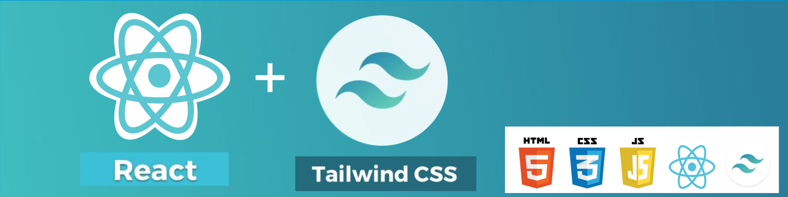

  

  
   
  

## About Me :man:

- 🔭 I’m currently training to become a full-stack software developer
- 🌱 I’m currently learning how to build great software at [Microverse Inc](https://github.com/microverseinc)
- :computer: Language stack: JavaScript, Tailwind CSS, Firebase, Rails, React
- 🌱 In love with building healthy habits using the [Fabulous app].(https://www.thefabulous.co)

## Stats

## Commit Streak

## Most Used Languages

